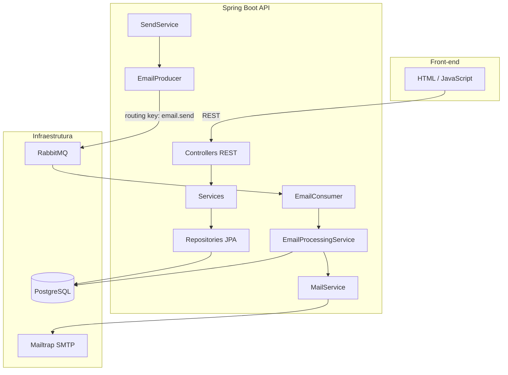
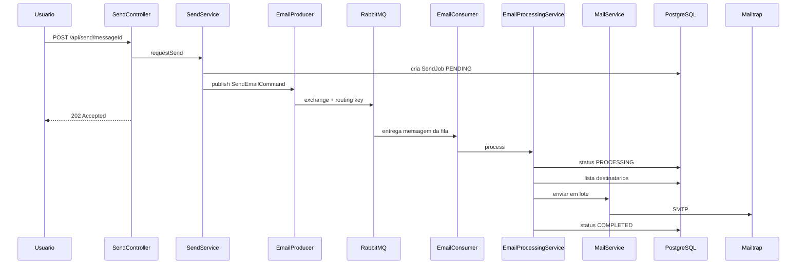
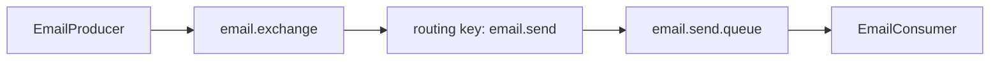

# Mensageria — Envio assíncrono de e-mails em lote

Sistema desenvolvido em Java/Spring Boot com RabbitMQ para envio de e-mails em lote de forma assíncrona.

## Integrantes

- Gabriel Martins Torres - 20241012001820

## Arquitetura



### Fluxo assíncrono



### RabbitMQ



| Elemento     | Nome                |
|--------------|---------------------|
| Exchange     | `email.exchange`    |
| Queue        | `email.send.queue`  |
| Routing Key  | `email.send`        |
| Producer     | `EmailProducer`     |
| Consumer     | `EmailConsumer`     |

## Principais classes

| Classe | Pacote | Responsabilidade |
|--------|--------|------------------|
| `RabbitMQConfig` | `config` | Exchange, fila, binding, conversor JSON |
| `EmailProducer` | `messaging` | Publica mensagens na fila |
| `EmailConsumer` | `messaging` | Consome mensagens (`@RabbitListener`) |
| `SendService` | `service` | Solicita envio (cria job + publica na fila) |
| `EmailProcessingService` | `service` | Processa envio em lote |
| `MailService` | `service` | Envia e-mail via SMTP |
| `RecipientController` | `controller` | CRUD de destinatários |
| `MessageController` | `controller` | CRUD de mensagens |
| `SendController` | `controller` | Solicitação de envio e histórico |

## Pré-requisitos

- Java 21
- Docker Desktop
- Conta no [Mailtrap](https://mailtrap.io) (Email Testing → SMTP)

## Como rodar

### 1. Subir infraestrutura

```bash
docker compose up -d
```

Serviços:
- PostgreSQL: `localhost:5432`
- RabbitMQ: `localhost:5672` (painel: http://localhost:15672 — guest/guest)

### 2. Configurar ambiente local

Copie o arquivo de exemplo — ele contém **toda a infra** (PostgreSQL, RabbitMQ, Mailtrap, porta):

```bash
cp src/main/resources/application-local.yml.example src/main/resources/application-local.yml
```

Edite `application-local.yml` e preencha usuário/senha SMTP do Mailtrap (Email Testing → SMTP Settings).

| Arquivo | O que contém |
|---------|--------------|
| `application.yml` | Configurações da aplicação (JPA, nome do app) |
| `application-local.yml` | Infra local + credenciais (não commitar) |

Alternativa via variáveis de ambiente (sobrescrevem o yml local):

```powershell
$env:MAILTRAP_USERNAME = "seu_usuario_smtp"
$env:MAILTRAP_PASSWORD = "sua_senha_smtp"
```

> **Importante:** não commite credenciais. O `application-local.yml` está no `.gitignore`.

### 3. Executar a aplicação

```bash
./mvnw spring-boot:run
```

Windows:

```powershell
$env:JAVA_HOME = "C:\Program Files\Java\jdk-21.0.11"
.\mvnw.cmd spring-boot:run
```

### 4. Acessar

- Front-end: http://localhost:8081
- API: http://localhost:8081/api/recipients
- RabbitMQ: http://localhost:15672

## Endpoints da API

| Método | Endpoint | Descrição |
|--------|----------|-----------|
| GET | `/api/recipients` | Lista destinatários |
| POST | `/api/recipients` | Cadastra destinatário |
| DELETE | `/api/recipients/{id}` | Remove destinatário |
| GET | `/api/messages` | Lista mensagens |
| POST | `/api/messages` | Cria mensagem |
| POST | `/api/send/{messageId}` | Solicita envio (202 Accepted) |
| GET | `/api/jobs` | Histórico de envios |
| GET | `/api/jobs/{id}` | Detalhe de um job |

## Evidências para entrega

1. **Front-end** — cadastro de destinatários, mensagens e envio
2. **RabbitMQ** — fila `email.send.queue` no painel (http://localhost:15672)
3. **Banco de dados** — tabelas `recipients`, `email_messages`, `send_jobs`
4. **Logs** — consumer processando mensagens no console
5. **Mailtrap** — e-mails recebidos na inbox de teste

## Roteiro sugerido para o vídeo

1. Mostrar arquitetura (diagrama ou README)
2. Subir Docker e aplicação
3. Cadastrar destinatários e criar mensagem no front-end
4. Solicitar envio e mostrar resposta imediata (202)
5. Mostrar mensagem na fila RabbitMQ
6. Mostrar consumer processando nos logs
7. Mostrar job `COMPLETED` na aba Envios
8. Mostrar e-mail no Mailtrap
9. Citar classes principais (Producer, Consumer, Config)
